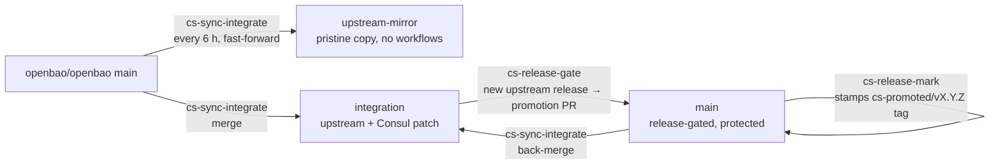
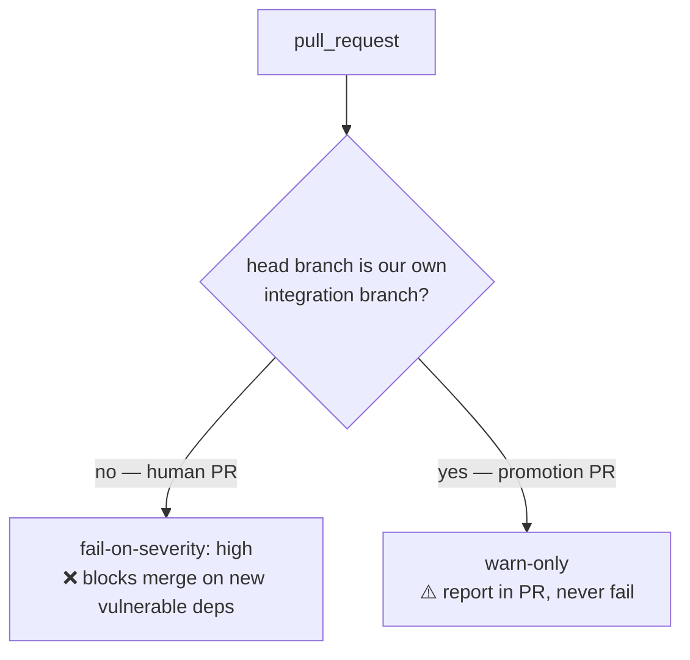
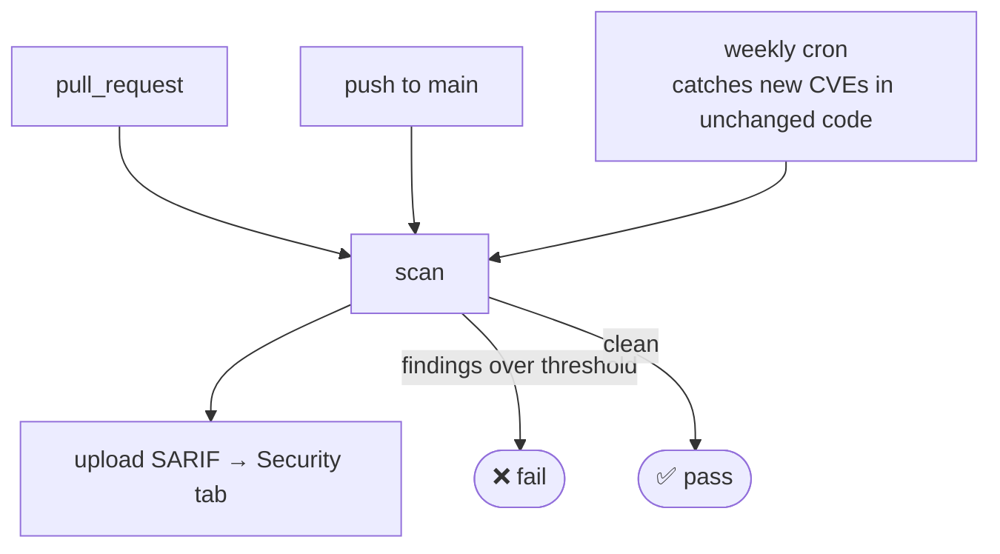
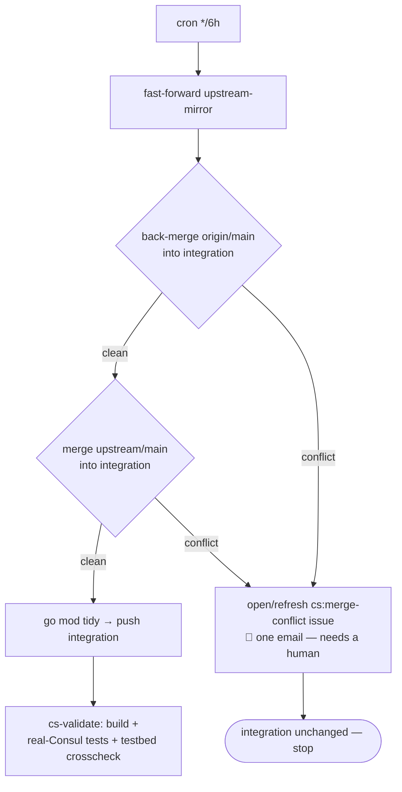
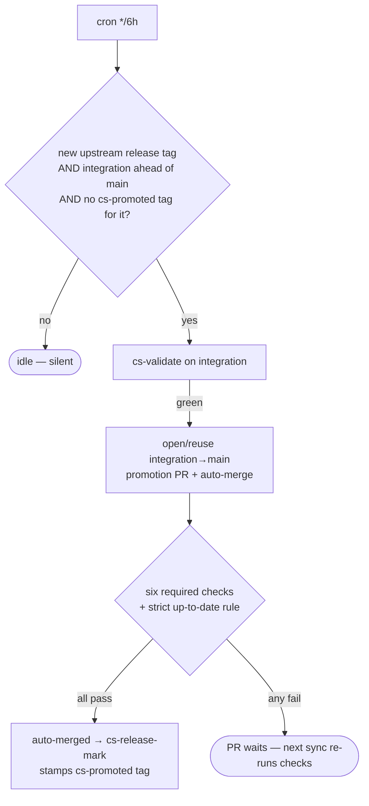
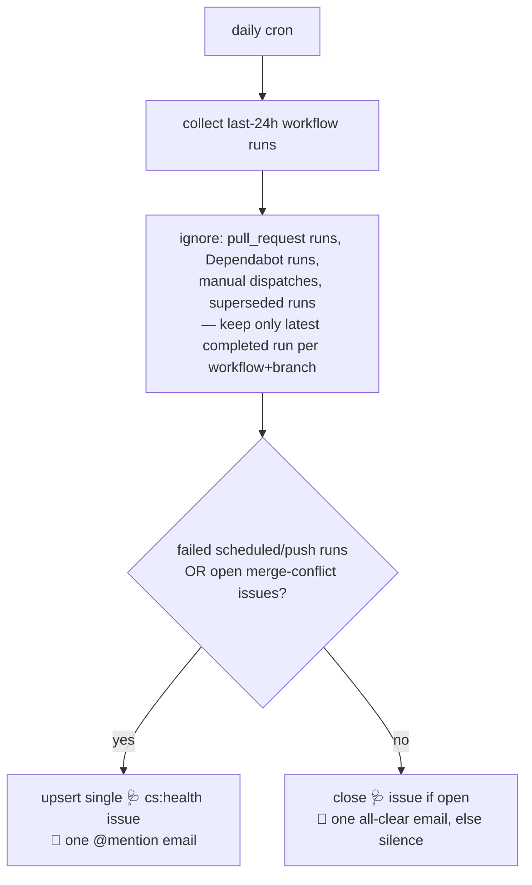

# contain-security fork — CI checks, visualized

Every check on this fork is either **ours** (`cs-*`, CodeQL) or **upstream's**
(inherited with the fork). Rule of thumb after the 2026-08 cleanup:

> **Only checks we own can gate or notify. Upstream workflows that cannot pass
> on this fork's PRs are disabled, not debugged.**

---

## 1. The big picture — three branches, one direction

- `upstream-mirror` — audit copy of upstream. Never edited.
- `integration` — upstream **plus our Consul code**. Continuously merged and
  validated. No required checks (validation runs post-merge via `cs-validate`).
- `main` — advances only when upstream tags a release, via an automated
  `integration → main` promotion PR that must pass the required checks below.
- The back-merge (`main → integration`) exists because branch protection's
  *strict up-to-date* rule refuses to merge a PR whose head lacks the base's
  tip. Promotion merge commits and direct-to-main CI fixes live only on main,
  so without the back-merge every later promotion PR sits on `BEHIND` forever
  and auto-merge never fires.

---

## 2. Required checks on `main` (all ours)

A PR into `main` — human or promotion — merges only when these six pass:

| Check (context) | Workflow | What it proves |
|---|---|---|
| `cs-lint` | cs-lint.yml | Fork-owned Go packages pass golangci-lint |
| `gosec` | cs-gosec.yml | No new Go SAST findings |
| `govulncheck` | cs-govulncheck.yml | No known-vulnerable code paths |
| `trivy-fs` | cs-trivy.yml | Scan completed; alerts land in the Security tab (code-scanning gates non-promotion PRs) |
| `Analyze (go)` | CodeQL (default setup, security-extended) | No new CodeQL alerts |
| `dependency-review` | cs-dependency-review.yml | No new high+ severity deps (see flow below) |

### cs-lint — why it exists instead of upstream's "Code checks"

Upstream's linter uses `only-new-issues`, which needs the PR diff from the
GitHub API. Promotion PRs regularly exceed the API's 300-file limit → HTTP 406
→ the action silently lints the **whole tree** → fails on *upstream's own*
pre-existing issues. Structurally unfixable on this fork, so we gate only what
we own:

```mermaid
flowchart TD
    T[any pull_request] --> DL[download golangci-lint 2.13.1\npinned + checksum-verified,\nsame version as upstream's workflow]
    DL --> RUN[lint FORK-OWNED packages only:\ninternal/physical/consul\ninternal/serviceregistration/consul]
    RUN -->|0 issues| PASS([✅ pass — any PR size, deterministic])
    RUN -->|issues| FAIL([❌ fail — our code, we fix it])
```

> Maintenance: `FORK_PACKAGES` in cs-lint.yml must list every Go package where
> the fork differs from upstream (same pattern as the test paths in
> cs-validate.reusable.yml). Currently runs with `--tests=false`: the fork's
> test files still carry upstream's inherited lint debt; drop the flag once the
> in-flight consul test cleanup lands.

### cs-dependency-review — hard gate for humans, advisory for promotions

Promotion PRs import upstream's dependency set wholesale; we can't remediate
their vulns at promotion time (Dependabot / trivy / govulncheck track them
continuously). So:

### cs-gosec / cs-govulncheck / cs-trivy — same shape

> cs-trivy skips the SARIF upload on promotion PRs: code scanning diffs
> PR-context SARIF against the base, and on an upstream-sized diff every
> inherited alert is reported as "new" — a red "Trivy" check for alerts we
> didn't introduce. Branch alerts stay covered by the push/schedule uploads.

---

## 3. The automation loop (scheduled, ours)

### cs-sync-integrate — every 6 h

### cs-release-gate — every 6 h

### cs-health-digest — daily 13:00 UTC, the ONLY thing that emails routinely

> If a 🩺 issue opens, it lists only failures that are (a) ours and (b) still
> the *current* state of that workflow. Anything it names is actionable.

---

## 4. Runs on PRs but never gates (informational)

| Workflow | Why it stays |
|---|---|
| Ensure Verified Commits | Only checks upstream-maintainer commits are signed; effectively always green here |
| Validate publiccode.yml | Trivial, inherited, passes |
| UI CI ("Test UI") | Upstream fixed their red `main` (was broken 2026-07/08); we don't touch the UI, green and quiet |
| Scorecard | Supply-chain posture → Security tab |
| cs-sbom / cs-build-attest | On push to main: SBOM + signed build provenance |
| Go Dependency Submission / Dependency Graph / Mirror | Plumbing that feeds dependency-review and Dependabot |

Dependabot **alerts** stay enabled (they feed the digest body as context) but
auto-PRs are off — the backlog is inherited from upstream and not our action
item.

---

## 5. Upstream workflows: disabled, and why

These run *upstream's* quality gates for *upstream's* development flow. On this
fork they either can't pass or test nothing we changed — each red run was a
notification for **code we didn't write**:

| Upstream workflow | Status | Reason |
|---|---|---|
| Run linters ("Code checks", "Semgrep") | **disabled** | 300-file diff limit → full-tree lint → fails on upstream's own issues. Replaced by `cs-lint`; SAST covered by cs-gosec + CodeQL |
| CI, Docs CI, Deploy docs, Check Changelog, CodeQL Advanced | **disabled** (since 06/2026) | Upstream release/docs plumbing; not applicable or conflicts with CodeQL default setup |

> ⚠️ **Ordering rule for future edits:** a workflow that provides a *required*
> status check must be removed from branch protection **before** it is
> disabled — a disabled required check leaves every PR stuck on "expected".

---

## 6. Notification map — what can actually email you

| Source | When | Cadence |
|---|---|---|
| 🩺 `cs:health` issue | A **current, ours, scheduled** failure exists | ≤ 1 @mention/day, closes itself when clear |
| `cs:merge-conflict` issue | Upstream merge needs human resolution | Once per conflict |
| Everything else | — | Silent by design |
